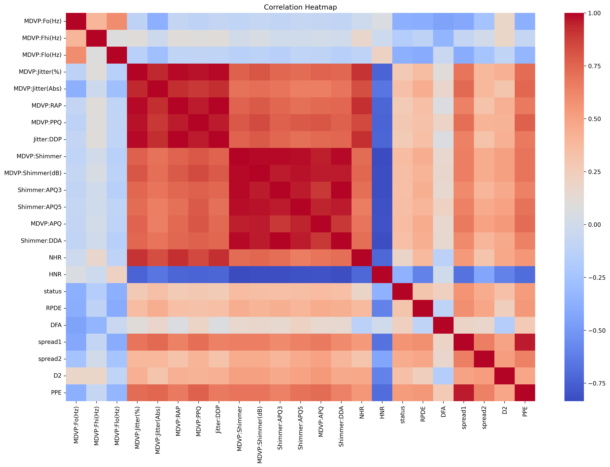
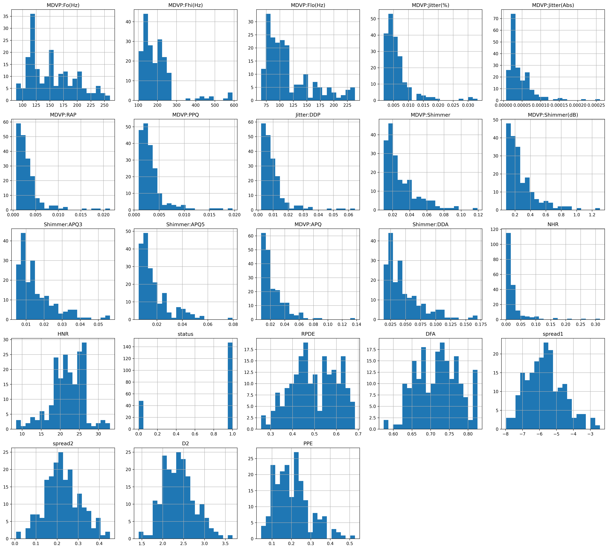
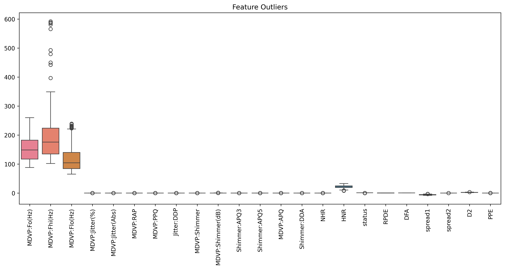
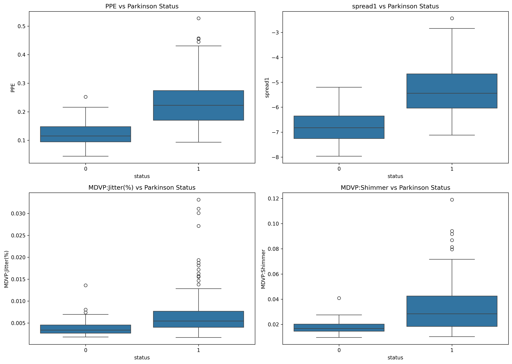
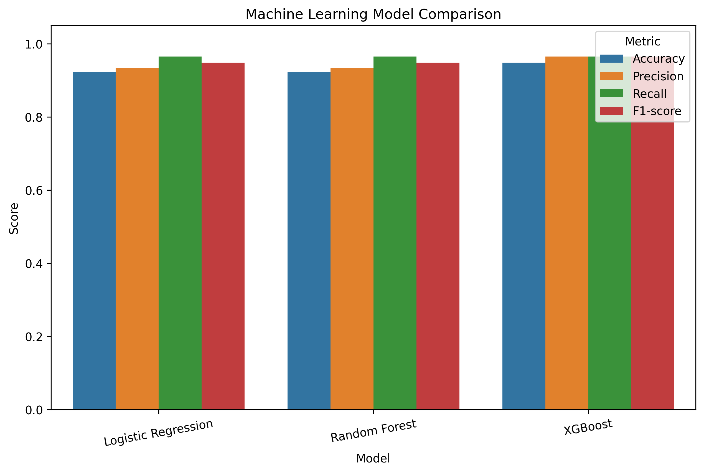
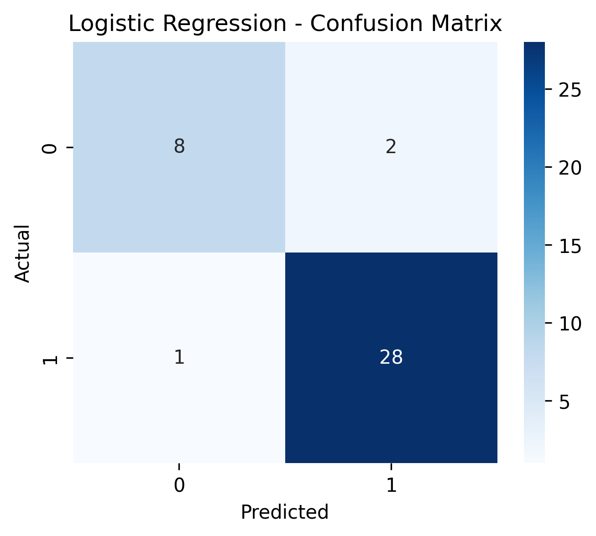
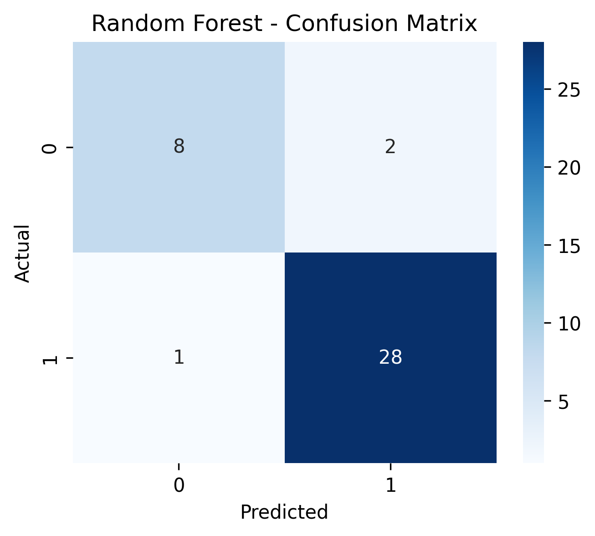
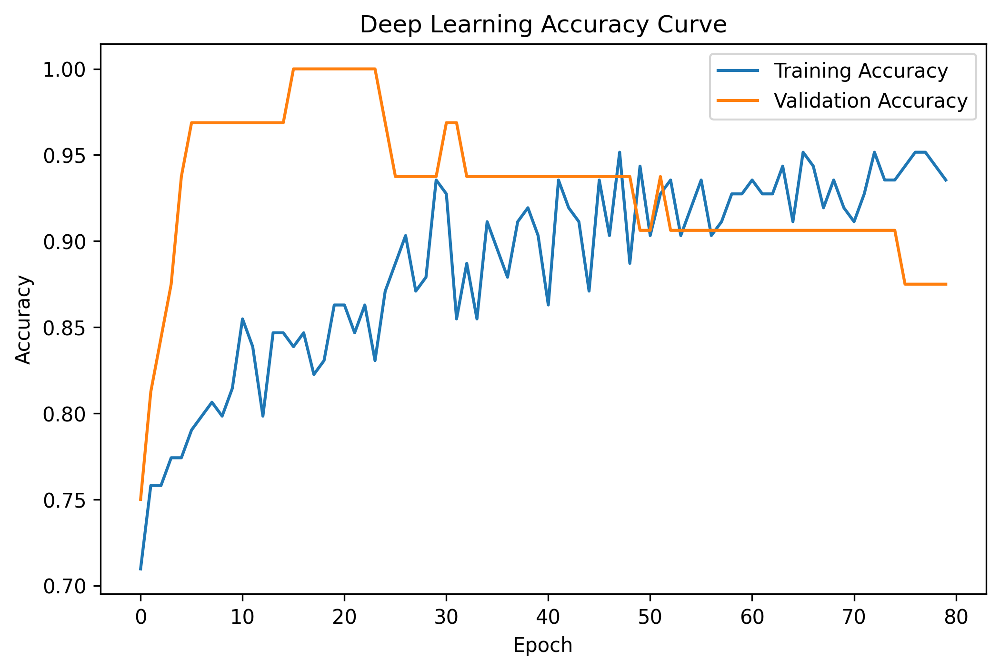
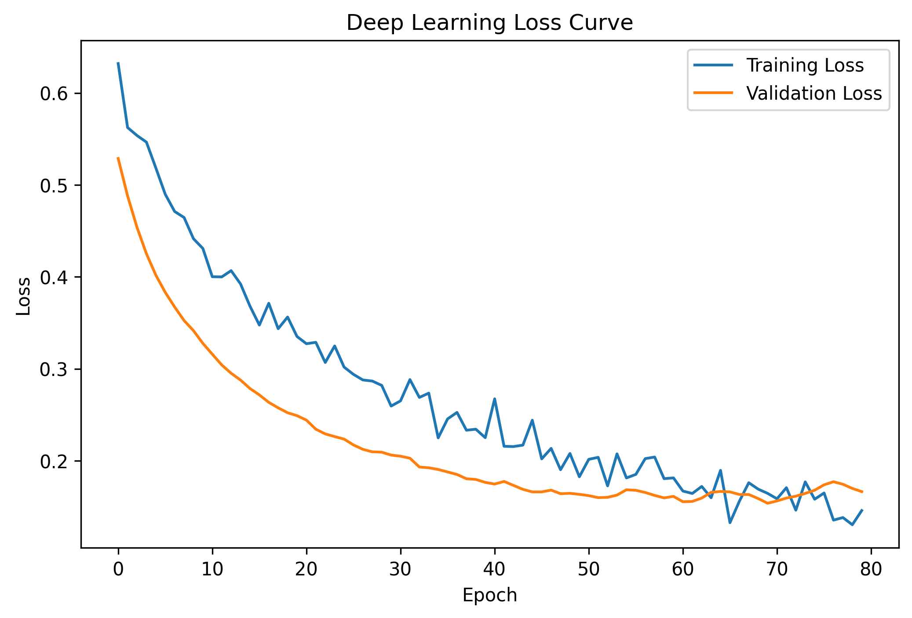
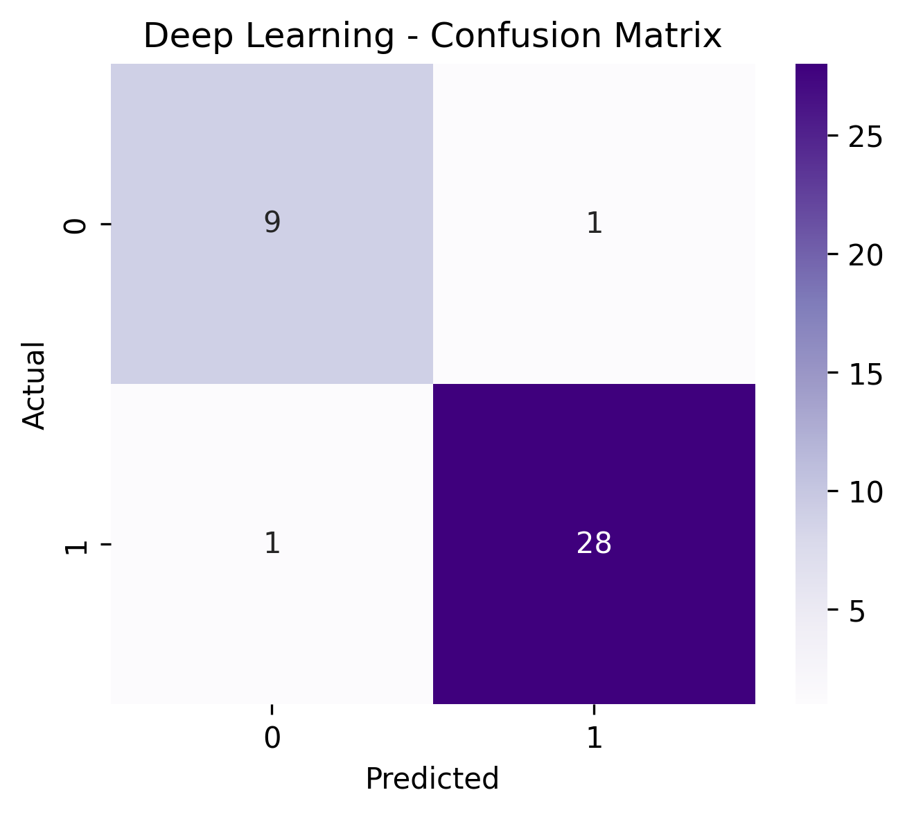

# Parkinson ML & Deep Learning Voice Analysis

Machine Learning and Deep Learning project focused on Parkinson’s Disease detection using biomedical voice measurements.

This project explores how classical Machine Learning algorithms and Deep Learning neural networks can classify Parkinson’s Disease using voice-based biomarkers.

---

# Project Goals

* Explore biomedical voice datasets related to Parkinson’s Disease
* Perform professional Exploratory Data Analysis (EDA)
* Train and compare multiple Machine Learning classification models
* Build and evaluate a Deep Learning neural network
* Analyze model performance and interpretability
* Create a reproducible and portfolio-ready ML project

---

# Dataset

The project uses the **UCI Parkinson’s Disease Dataset**, which contains multiple biomedical voice measurements extracted from speech recordings.

The target variable:

* `0` → Healthy
* `1` → Parkinson

Examples of analyzed voice biomarkers:

* Fundamental frequency (`MDVP:Fo`)
* Jitter
* Shimmer
* Harmonicity
* Nonlinear dynamical complexity measurements

---

# Project Structure

```text
parkinson-ml-dl-voice-analysis/
│
├── data/
│   └── parkinsons.csv
│
├── images/
│   ├── eda/
│   ├── ml/
│   └── deep_learning/
│
├── notebooks/
│   ├── 01_eda_parkinson.ipynb
│   ├── 02_ml_models_parkinson.ipynb
│   └── 03_deep_learning_parkinson.ipynb
│
├── README.md
└── requirements.txt
```

---

# Exploratory Data Analysis (EDA)

The EDA phase focused on:

* Dataset exploration
* Feature distributions
* Correlation analysis
* Outlier detection
* Parkinson vs Healthy comparison

## Key Visualizations

### Correlation Heatmap



### Feature Distributions



### Outlier Analysis



### Most Important Features



---

# Machine Learning Models

Several classical Machine Learning models were trained and evaluated:

* Logistic Regression
* Random Forest
* XGBoost

Evaluation metrics:

* Accuracy
* Precision
* Recall
* F1-score
* Confusion Matrix

---

# Machine Learning Results

| Model               | Accuracy |
| ------------------- | -------- |
| Logistic Regression | 0.9231   |
| Random Forest       | 0.9231   |
| XGBoost             | 0.9487   |

## Model Comparison



---

# Confusion Matrices

## Logistic Regression



## Random Forest



## XGBoost


---

# Deep Learning

A feedforward neural network was implemented using TensorFlow/Keras.

Architecture:

* Dense layers
* ReLU activations
* Dropout regularization
* Sigmoid output layer

---

# Deep Learning Results

| Metric    | Score  |
| --------- | ------ |
| Accuracy  | 0.9487 |
| Precision | 0.9655 |
| Recall    | 0.9655 |
| F1-score  | 0.9655 |

## Training Accuracy Curve



## Training Loss Curve



## Deep Learning Confusion Matrix



---

# Main Conclusions

* Voice biomarkers contain highly predictive information for Parkinson detection.
* Classical Machine Learning models already achieve strong performance.
* XGBoost achieved the best overall classical ML performance.
* Deep Learning achieved competitive results but did not drastically outperform XGBoost.
* This demonstrates that Deep Learning is not always superior for small tabular biomedical datasets.

---

# Technologies Used

* Python
* Pandas
* NumPy
* Matplotlib
* Seaborn
* Scikit-learn
* XGBoost
* TensorFlow / Keras
* Google Colab
* Git & GitHub

---

# Future Improvements

Potential future developments:

* Hyperparameter tuning
* Cross-validation
* Larger biomedical datasets
* Audio spectrogram analysis
* CNN architectures for voice analysis
* Real-world voice recordings
* Deployment as an interactive web application

---

# Author

Beatriz Lamiquiz

AI • Machine Learning • Python • Biomedical Data Projects
